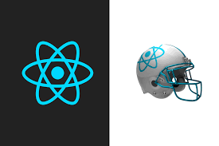

<h1 align="center">
    
</h1>

  
  

  <a href="#rocket-stack">Stack</a>&nbsp;&nbsp;&nbsp;|&nbsp;&nbsp;&nbsp;
  <a href="#-project">Project</a>&nbsp;&nbsp;&nbsp;|&nbsp;&nbsp;&nbsp;
  <a href="#-how-to-contribute">How to contribute</a>&nbsp;&nbsp;&nbsp;|&nbsp;&nbsp;&nbsp;
  <a href="#memo-license">License</a>&nbsp;&nbsp;&nbsp;|&nbsp;&nbsp;&nbsp;
  <a href="#memo-license">License</a>&nbsp;&nbsp;&nbsp;|&nbsp;&nbsp;&nbsp;
  <a href="docs/index.md">Docs</a>

  

    <a href="https://instagram-gfs.netlify.app/"> URL Project</a>
            
    

 

 

## :rocket: Stack

This project was build with the following stack:

- [React](https://reactjs.org) 
- [Styled Components](https://styled-components.com/)

TODO...

## 💻 Project
Este Projeto é para construir uma aplicação Api  Rest em Node js, React e React-native e  web e mobile app

- Fork this repository;
- Create a branch with your feature: `git checkout -b my-feature`;
- Commit your changes: `git commit -m 'feat: My new feature'`;
- Push to your branch: `git push origin my-feature`.

Delete your branch after the merge of your pull request is done.
---

